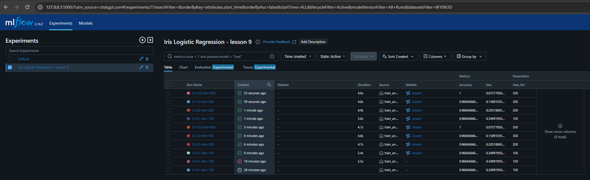
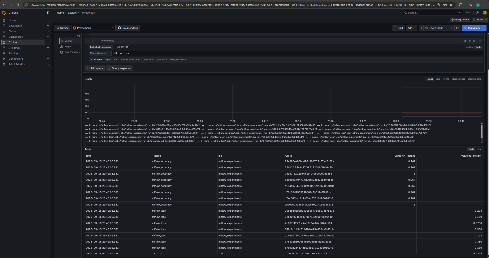
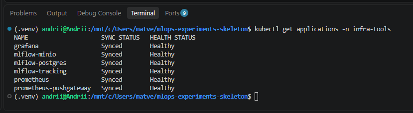
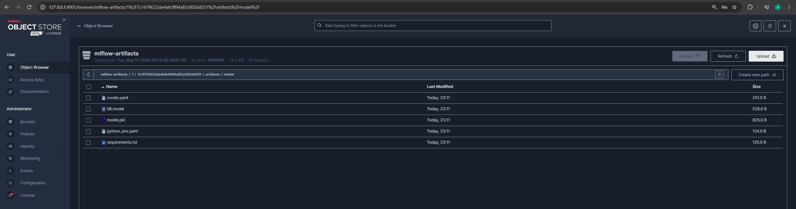

# ДЗ №9: MLflow experiments і метрики у Grafana

Цей проєкт демонструє запуск і відстеження ML-експериментів за допомогою MLflow та візуалізацію їхніх метрик у Grafana. Під час експериментів параметри, метрики й артефакти моделей зберігаються через MLflow, а метрики `accuracy` і `loss` передаються через PushGateway до Prometheus для подальшого перегляду в Grafana. Розгортання компонентів у Kubernetes виконується декларативно через Argo CD.

## Архітектура

```text
train_and_push.py
├─> MLflow ─> PostgreSQL
│          └─> MinIO
└─> PushGateway ─> Prometheus ─> Grafana

Git (lesson-9) ─> Argo CD ─> Kubernetes
```

MLflow використовується для керування експериментами, але для постійного зберігання використовує окремі сховища: PostgreSQL для метаданих експериментів і MinIO для артефактів моделей. PushGateway потрібен тому, що `train_and_push.py` є короткоживучим процесом і не надає постійний `/metrics` endpoint, який Prometheus міг би регулярно опитувати. Скрипт передає метрики до PushGateway, звідки їх отримує Prometheus і передає для візуалізації в Grafana.

## Структура проєкту

```text
.
├── argocd/
│   ├── applications/
│   └── workloads/
├── assets/
├── best_model/
├── experiments/
│   ├── Dockerfile
│   ├── requirements.txt
│   └── train_and_push.py
├── tests/
├── .env.example
├── .gitignore
└── README.md
```

- `argocd/` - маніфести Argo CD Applications та Kubernetes workloads для розгортання компонентів проєкту.
- `experiments/` - скрипт запуску ML-експериментів, залежності та Dockerfile.
- `best_model/` - каталог, у який автоматично завантажується найкраща модель після завершення експериментів.
- `tests/` - юніт-тести для перевірки логіки вибору найкращої моделі.

## Розгортання через Argo CD

Argo CD працює в namespace `infra-tools`. MLflow, PostgreSQL і MinIO розгортаються в namespace `application`, а PushGateway, Prometheus і Grafana - у namespace `monitoring`.

```bash
kubectl apply -f argocd/applications/

kubectl get applications -n infra-tools

kubectl get pods -n application
kubectl get pods -n monitoring
```

Усі Argo CD Applications після розгортання повинні мати статус `Synced` та `Healthy`.

## Локальний доступ через port-forward

Для локального доступу до сервісів виконайте команди в окремих терміналах:

```bash
# MLflow
kubectl port-forward -n application service/mlflow 5000:5000

# MinIO API та Console
kubectl port-forward -n application service/minio 9000:9000 9001:9001

# PushGateway
kubectl port-forward -n monitoring service/pushgateway-prometheus-pushgateway 9091:9091

# Grafana
kubectl port-forward -n monitoring service/grafana 3001:80
```

Після цього сервіси доступні локально:
- MLflow - `http://127.0.0.1:5000`
- MinIO Console - `http://127.0.0.1:9001`
- PushGateway - `http://127.0.0.1:9091`
- Grafana - `http://127.0.0.1:3001`

## Запуск експериментів

Скопіюйте файл зі змінними середовища:

```bash
cp .env.example .env
```

Для сумісності з MLflow 2.14.3 експерименти запускаються в Docker-контейнері з Python 3.12:

```bash
docker build -f experiments/Dockerfile -t mlflow-experiment:1.0 .

docker run --rm \
  --add-host=host.docker.internal:host-gateway \
  -e MLFLOW_TRACKING_URI=http://host.docker.internal:5000 \
  -e PUSHGATEWAY_URL=http://host.docker.internal:9091 \
  -e MLFLOW_S3_ENDPOINT_URL=http://host.docker.internal:9000 \
  -e AWS_ACCESS_KEY_ID=minioadmin \
  -e AWS_SECRET_ACCESS_KEY=minioadmin123 \
  -v "$(pwd)/best_model:/app/best_model" \
  mlflow-experiment:1.0
```

Залежності для запуску без Docker описані у `experiments/requirements.txt`:

```bash
pip install -r experiments/requirements.txt
python experiments/train_and_push.py
```

Під час успішного запуску в консолі відображаються `run_id`, параметри `C` і `max_iter`, метрики `accuracy` та `loss` для кожного запуску, а наприкінці - параметри та метрики найкращої моделі.

## Перевірка результату

Після успішного запуску експериментів результат можна перевірити так:

- **MLflow UI** - відкрити `http://127.0.0.1:5000`, вибрати експеримент `Iris Logistic Regression - lesson 9` і перевірити запуски, параметри `C`, `max_iter` та метрики `accuracy`, `loss`.
- **best_model/** - після завершення експериментів у каталозі `best_model/model/` повинні з'явитися файли найкращої моделі: `MLmodel`, `model.pkl`, `conda.yaml`, `python_env.yaml` та `requirements.txt`.
- **PushGateway** - перевірити наявність метрик командою:

```bash
curl -s http://127.0.0.1:9091/metrics | grep -E "mlflow_accuracy|mlflow_loss"
```

- **Grafana** - відкрити `Explore`, вибрати datasource `Prometheus` та виконати PromQL-запити:

```promql
mlflow_accuracy
mlflow_loss
```

Для найкращого запуску було отримано `accuracy = 1.0` та `loss ≈ 0.0758`.

## Скріншоти

### MLflow - результати експериментів

На скріншоті показано експеримент `Iris Logistic Regression - lesson 9` із запусками для різних значень `C` та `max_iter`, а також отриманими метриками `accuracy` і `loss`.



### Grafana - метрики експериментів

У Grafana Explore через datasource Prometheus відображаються метрики `mlflow_accuracy` та `mlflow_loss`, отримані з PushGateway.



### Argo CD - стан розгортання

Усі компоненти проєкту розгорнуті через Argo CD та мають статуси `Synced` і `Healthy`.



### MinIO - артефакти MLflow

У bucket `mlflow-artifacts` збережені артефакти MLflow. Для найкращого запуску доступні файли моделі `MLmodel`, `model.pkl`, `conda.yaml`, `python_env.yaml` та `requirements.txt`.



## Прибирання ресурсів

Після завершення роботи платні AWS-ресурси необхідно видалити, щоб уникнути подальших витрат.

Спочатку видаляються ресурси Argo CD:

```bash
cd /mnt/c/Users/matve/goit-devops-hw-07/terraform/argocd
terraform destroy
```

Потім видаляється EKS-кластер:

```bash
cd /mnt/c/Users/matve/goit-devops-hw-07/eks
terraform destroy
```

Після цього видаляються ресурси VPC:

```bash
cd /mnt/c/Users/matve/goit-devops-hw-07/vpc
terraform destroy
```

S3-бакет, який використовується для зберігання Terraform state, можна залишити для наступних робіт.
